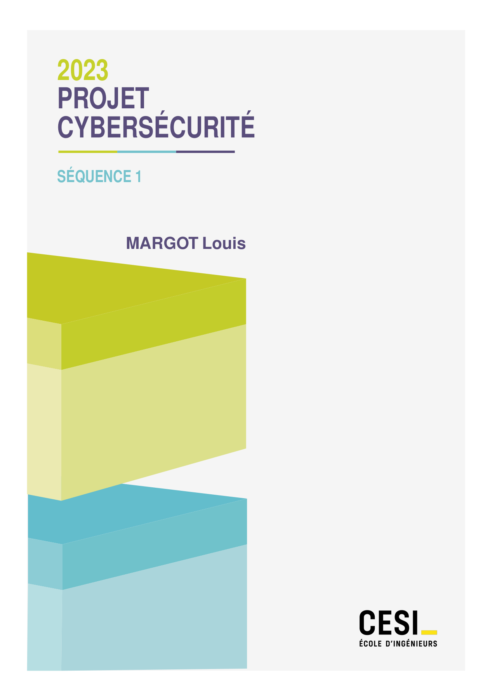

# Design Report LaTeX Class

This is a LaTeX class of a design report. As I am a student of CESI engineering
school, the example includes the logo of the school. You can easily change it
by replacing the file `logo.png` by your own logo.

## Screenshots

### Title page

On this screenshot, every title variables are set. **Only the title is mandatory**, others are optional.



### Table of contents

By default the table of content does not enforce a new page. For this just add
`\newpage` after `\tableofcontents`.


### Content (sections, etc)


## Copyrigths

### logo/logo.png

First of all, I don't own the logo of CESI. I just use it for my own design
report. If you want to use it, you shall ask the school for permission.

### help/tikz_export.py

This script is not mine. Here's the original source:
[https://github.com/xyz2tex/svg2tikz](https://github.com/xyz2tex/svg2tikz)

The script is under the GNU license.

### help/titlePage.svg

Svg file of the figure on the title page. Made using Inkscape, I made it so you
can use it as you per the rights below.

### designreport/*

Except for the PDF file, where the logo of the school is used, the files are
under the GNU license. See the file `LICENSE` for more information.

## How to use

### Design report

Basic usage (`%` are optional):

```latex
\documentclass{designreport}

\title{Title of the report}
\subtitle{Subtitle of the report} %
\author{Author} %
\date{2023} %
\icon{logo.png} %

\begin{document}
\maketitle %
...
\end{document}
```

#### Install locally

You can install the class locally by copying `designreport.cls` in the folder where your `.tex` file is. Like the example in the folders or here:

- `designreport.cls`
- `main.tex`

#### Install globally

The following instructions are for TeXLive. If you use another LaTeX distribution, you can find the documentation on the internet. Plus they were not tested.

On Linux, you can install the class globally by copying `designreport.cls` in
`/usr/share/texlive/texmf-dist/tex/latex/` and then run `sudo texhash`.

On Windows, you can install the class globally by copying `designreport.cls` in
`C:\texlive\texmf-local\tex\latex\` and then run `texhash`.

### Tikz

You can use the `tikz_export.py` script to convert svg files to tikz. Here's an
example:

```shell
python3 tikz_export.py titlePage.svg --output titlePage.tex
```

Then, you can use the file `titlePage.tex` in your LaTeX document. I did copy/paste the output and added scope to move the figure to the right place:

```latex
% svg is A4 size for those coordinates

\begin{scope}[shift={(-3.2,-27.2)}] % x, y
% content of the `tikzpicture` env
% in output of `tikz_export.py`
\end{scope}
```

You can create your svg file using any svg editor like Inkscape or Illustrator.
(gedit/notepad is even an option ^^.)
